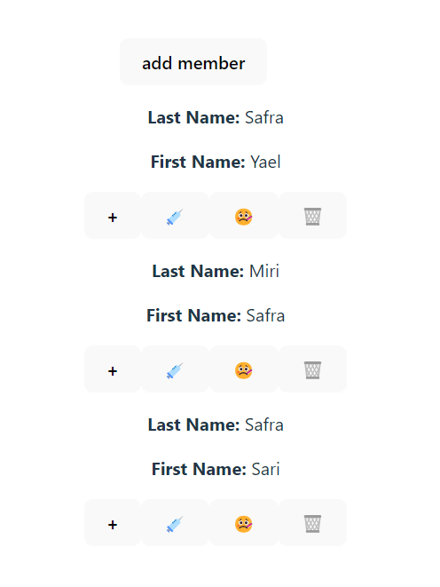
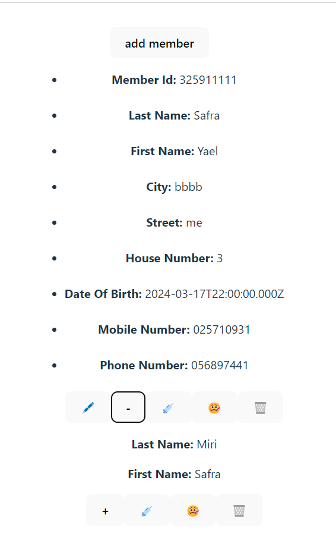
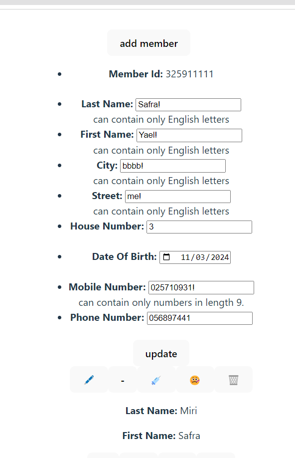
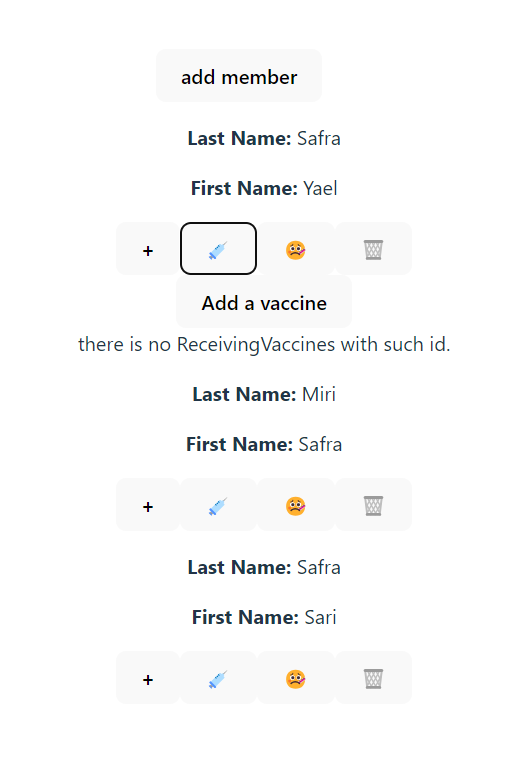
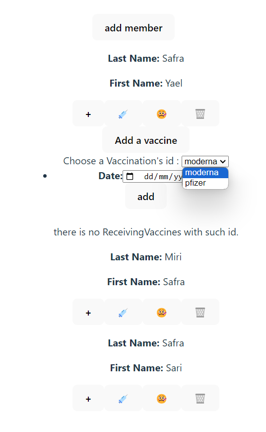
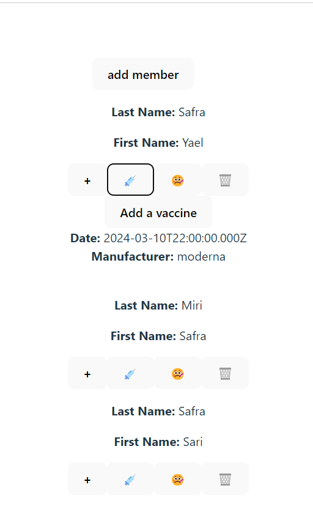
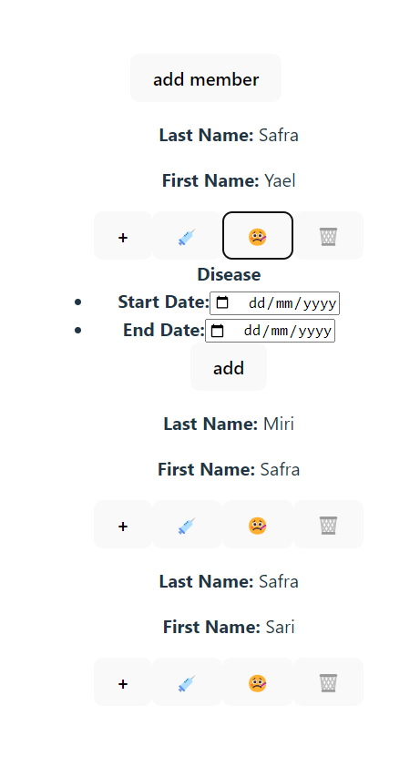
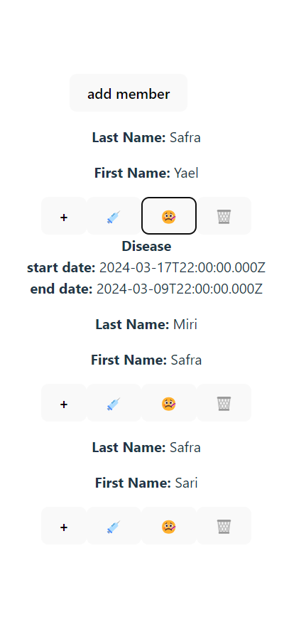
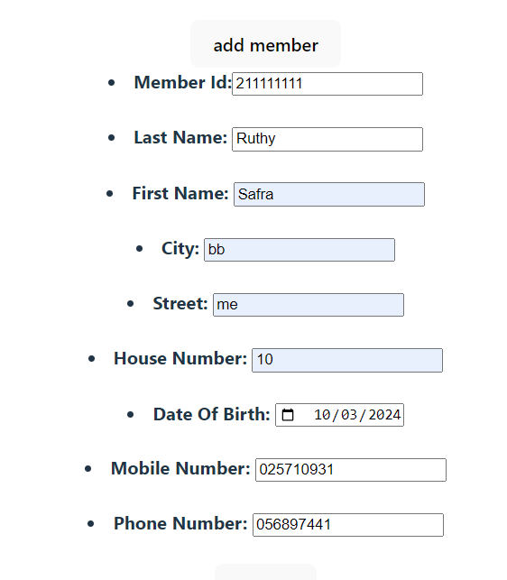
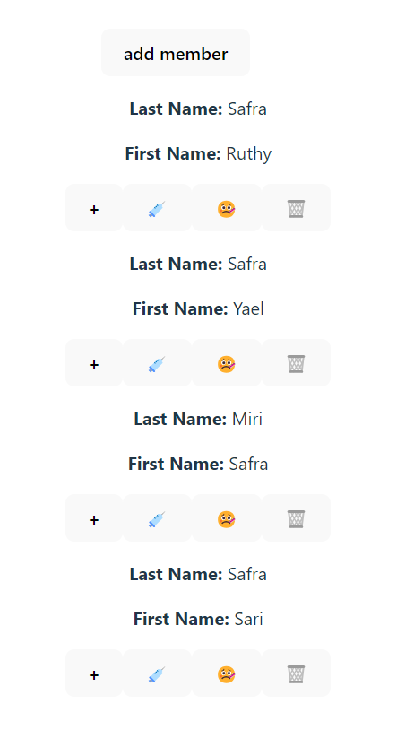

# Hadasim

# HMO System

A system that provides information services about members of an HMO.

## How to use the site?

#### Welcome to the site:

#### View user information:

#### Edit user information:

##### Adding a vaccination receiving to a member:

##### Add a vaccine:

##### It has been added!

##### Add illness to a friend

#### It has been added!

Add a new member:

It has been added!


## Built With
React ,
node.js ,
MySql.

## Run Locally

Clone the project

```bash
git clone https://github.com/SariSafra/Hadasim/tree/main/exe1Hadasim
```
#
Run the "createTables" file in your database that is located in the "mysql" folder.
#
Change the configuration file according to the port on which you are running the server and also the details about the database.
#

Go to the server directory:

```bash
cd server
```

Install dependencies:

```bash
npm -v
  ```
```bash
npm i nodemon
  ```  
  ```bash
npm i mysql2
  ```
```bash
npm install express
  ```
  ```bash
npm install cors
  ```
Start the server

```bash
npm run startSever
```

Change in the client configuration file in Tools the port where your server is located.

Go to the client directory:
```bash
cd client
  ```
  ```bash
npm install  react-router-dom
  ```
Start the client:

  ```bash
npm run dev
  ```

# API architecture:
Member Endpoints:

/member/: GET (Retrieve all members), POST (Add a new member)
/member/:id: GET (Retrieve a specific member by ID), PUT (Update a specific member by ID), DELETE (Delete a specific member by ID)
Vaccination Endpoints:

/vaccination/: GET (Retrieve all vaccinations), POST (Add a new vaccination)
/vaccination/:id: GET (Retrieve a specific vaccination by ID), PUT (Update a specific vaccination by ID), DELETE (Delete a specific vaccination by ID)
Receiving Vaccines Endpoints:

/ReceivingVaccines/: GET (Retrieve all receiving vaccine records), POST (Add a new receiving vaccine record)
/ReceivingVaccines/:MemberId/:VaccinationId: GET (Retrieve a specific receiving vaccine record by Member ID and Vaccination ID), PUT (Update a specific receiving vaccine record by Member ID and Vaccination ID), DELETE (Delete a specific receiving vaccine record by Member ID and Vaccination ID)
Corona Endpoints:

/corona/: GET (Retrieve all corona cases), POST (Add a new corona case)
/corona/:id: GET (Retrieve a specific corona case by Member ID), PUT (Update a specific corona case by Member ID), DELETE (Delete a specific corona case by Member ID)

